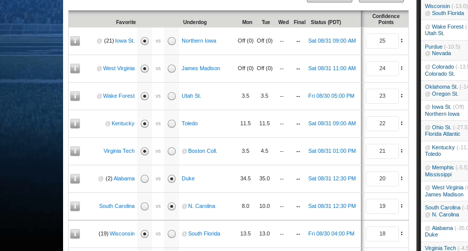

# Yahoo Pick'em Drag-n-drop UI

A Javascript userscript to add drag and drop UI to [Yahoo Pick'em](https://football.fantasysports.yahoo.com). This makes tampering with your pick'em a breeze!

## Installing the script using Tampermonkey

Installing the userscript via Tampermonkey will automatically run it everytime you visit the Pick'em site. Note that you will have to repeat steps 2-4 to receive future updates to this script.

1. Install the [Tampermonkey extension](https://www.tampermonkey.net/), supported for all major browsers.

2. Click this link to navigate to the script URL: [https://ajhodges.github.io/pickem-dnd/pickem-dnd.user.js](https://ajhodges.github.io/pickem-dnd/pickem-dnd.user.js)

3. Tampermonkey will detect the userscript and will open a new tab. Click on `Install to Tampermonkey` and click Ok.

4. Refresh the Pick'em site and the new UI should be activated.

## Using the script as a JavaScript bookmark

Fast and lightweight way to run the script, but requires a manual re-run each time the page is loaded.

1. Go to the bookmark menu of your browser and add a new bookmark with the title of your choice.

2. Copy the following snippet and paste it into the URL-Field: `javascript:(function(){document.body.appendChild(document.createElement('script')).src='https://ajhodges.github.io/pickem-dnd/pickem-dnd.user.js';})();`

3. Save the Bookmark.

4. From now on, you can just click on that bookmark when you have the Pick'em tab open to enable the script.

## Using the script via the console

If you don't want or can't install the previously mentioned browser extension, one possibility is to run the script via the developer console. However, you will need to rerun the script every time you refresh the pick'em.

1. On the Pick'em page, open your broser's developer console.
    * On Firefox, press `Ctrl` + `Shift` + `K`
    * On Chrome, press `Ctrl` + `Shift` + `J`
    * On Safari, press `Ctrl` + `Alt` + `I`
    * On IE9+, press `F12`
    * On Opera, press `Ctrl` + `Shift` + `I`
    * If you are having trouble opening your console, try reading the in depth explanation [here](http://webmasters.stackexchange.com/questions/8525/how-to-open-the-javascript-console-in-different-browsers)

2. Copy the following snippet and paste it into the developer console on the Pick'em page: `javascript:(function(){document.body.appendChild(document.createElement('script')).src='https://ajhodges.github.io/pickem-dnd/pickem-dnd.user.js';})();`

3. Press `Enter` to run the code.

## Update Log

Version 1.0 (2019/08/27)
- Initial release with basic dnd functionality
